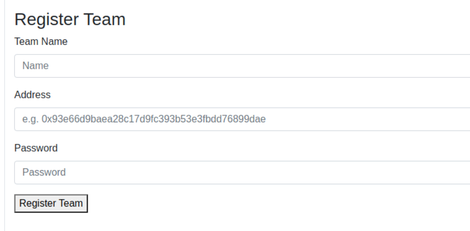
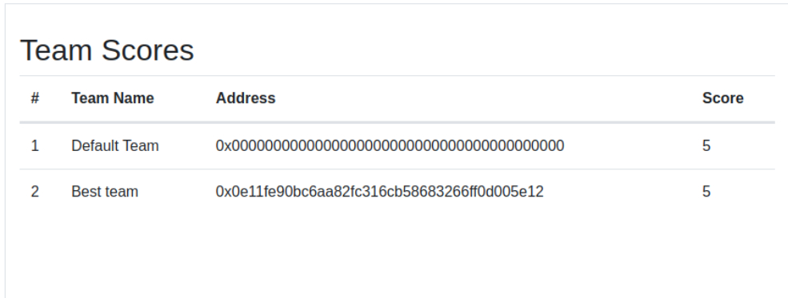
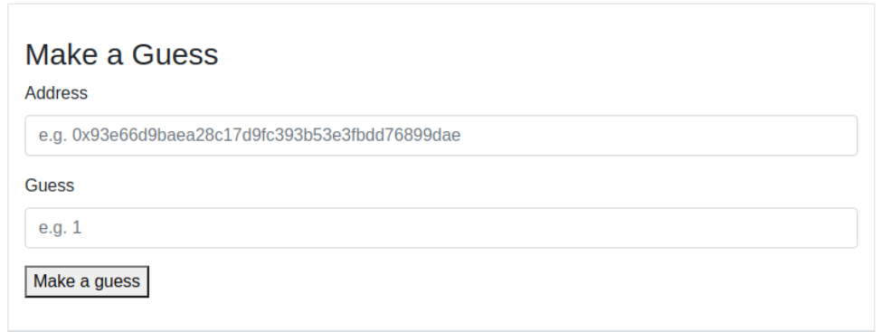

# Lesson 14 - Lottery Game

# Instructions

## Aim

The aim of the game is to get to the top of the leaderboard, so get as high a score as you
can, and make sure the other teams get a low score.

## Playing the game

1. Talk to your team mates and chose a team name

2. Ensure your team has some Goerli ether, you will need about 0.5 ETH
   If you need some ETH, go to Faucet or ask on sli.do

3. You will need to have metamask installed

4. Go to the game website : https://lottery.extropy.live/

5. Register your team, you need

- A team name
- Your wallet address
- A password

To register your team, you will need to pass in some ETH.
Your team should now appear on the leader board

You can now play the game

6. Make a guess at the random number, you need to enter

- your teams address
- Your guess at the random number (it is a small number < 50)
  
  If you guess correctly you will get points, otherwise you will lose points

7. You will see that the contract has some ether, an additional challenge is to see if you can
   drain the contract.

## Contract code

These gists [Lottery](https://gist.github.com/letsgitcracking/7298877cd143b5fe0ba0a692e449647b) [Oracle](https://gist.github.com/letsgitcracking/a7bf392391834a19d63edc32c9e5d9d2) have the contract code
Read through the code and think how you can exploit it.
