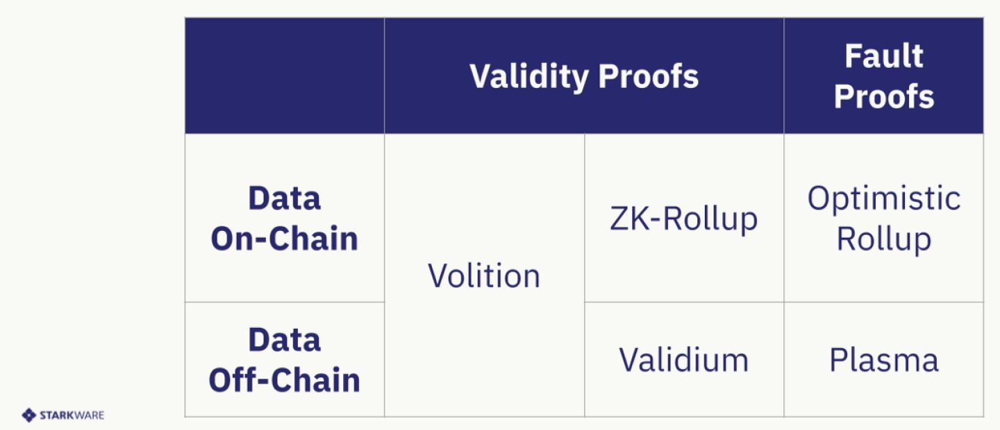

## Homework 15 Solution
1. To see Reentrancy attack visit [ReenterLottery contract](./ReenterLottery.sol) and [Reentrancy Steps](./ReentrancySteps.md).
2. Currently the two main scalability solutions are layer 2 rollups: Optimistic and ZK rollups.
This is the comparison with criterias to choose between the two:

| Property                           | Optimistic rollups                                                                                                                       | ZK rollups                                                                                                                                                                                                                             |
|------------------------------------|------------------------------------------------------------------------------------------------------------------------------------------|----------------------------------------------------------------------------------------------------------------------------------------------------------------------------------------------------------------------------------------|
| Fixed gas cost per batch           | ~40,000 (a lightweight transaction that mainly just changes the value of the state root)                                                 | ~500,000 (verification of a ZK-SNARK is quite computationally intensive)                                                                                                                                                               |
| Withdrawal period                  | ~1 week (withdrawals need to be delayed to give time for someone to publish a fraud proof and cancel the withdrawal if it is fraudulent) | Very fast (just wait for the next batch)                                                                                                                                                                                               |
| Complexity of technology           | Low                                                                                                                                      | High (ZK-SNARKs are very new and mathematically complex technology)                                                                                                                                                                    |
| Generalizability                   | Easier (general-purpose EVM rollups are already close to mainnet)                                                                        | Harder (ZK-SNARK proving generalpurpose EVM execution is much harder than proving simple computations, though there are efforts (eg. Cairo) working to improve on this)                                                                |
| Per-transaction on-chain gas costs | Higher                                                                                                                                   | Lower (if data in a transaction is only used to verify, and not to cause state changes, then this data can be left out, whereas in an optimistic rollup it would need to be published in case it needs to be checked in a fraud proof) |
| Off-chain computation costs        | Lower (though there is more need for many full nodes to redo the computation)                                                            | Higher (ZK-SNARK proving especially for general-purpose computation can be expensive, potentially many thousands of times more expensive than running the computation directly)                                                        |

Another matter is Data Availability:
In order to re create the state, transaction data is needed, the data availability question is
where this data is stored and how to make sure it is available to the participants in the
system.

